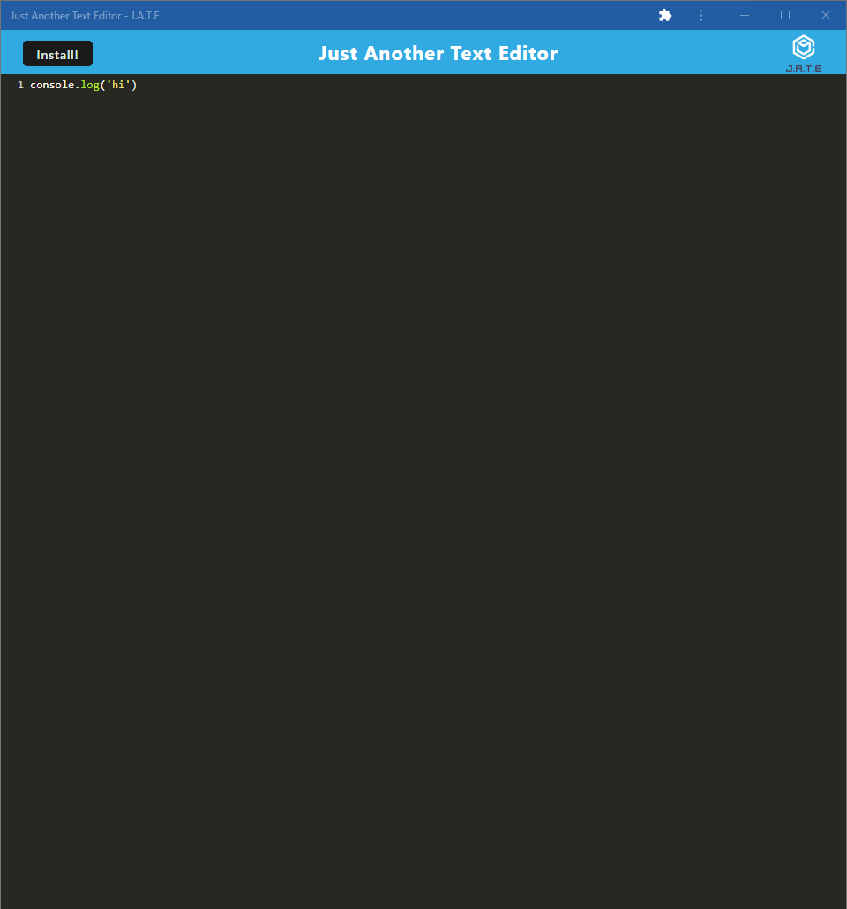
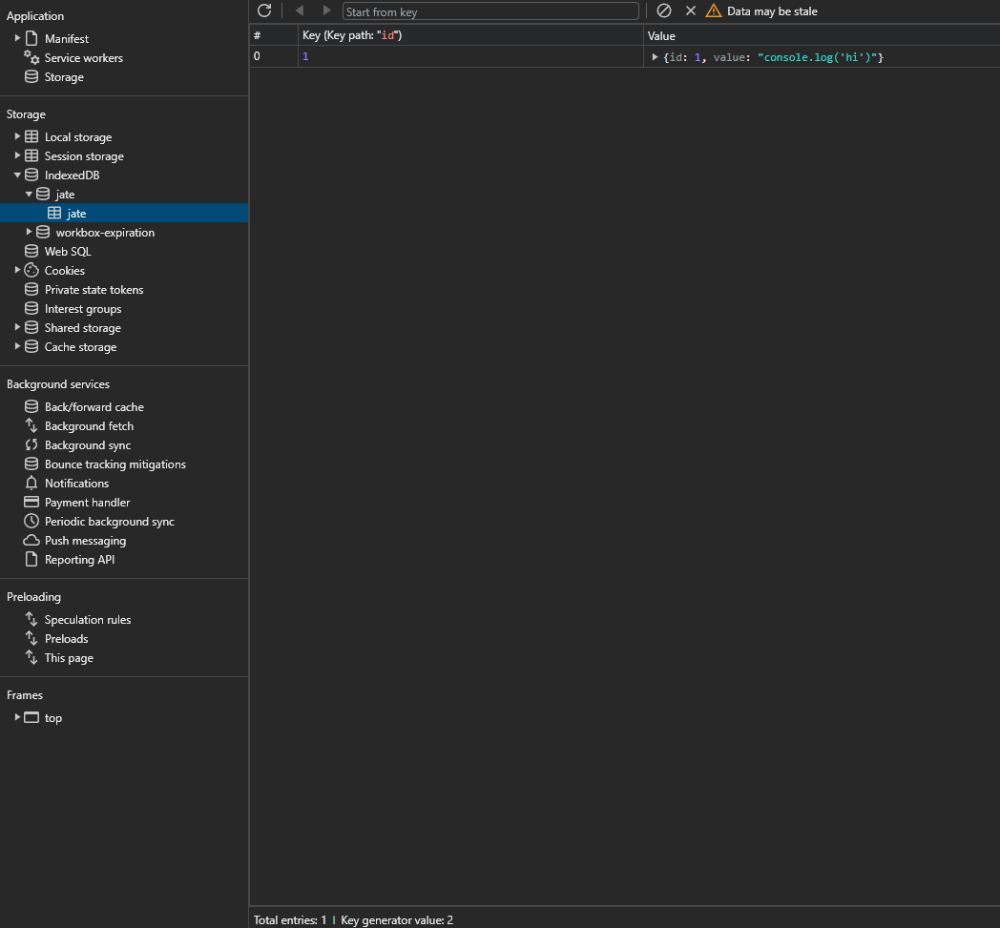
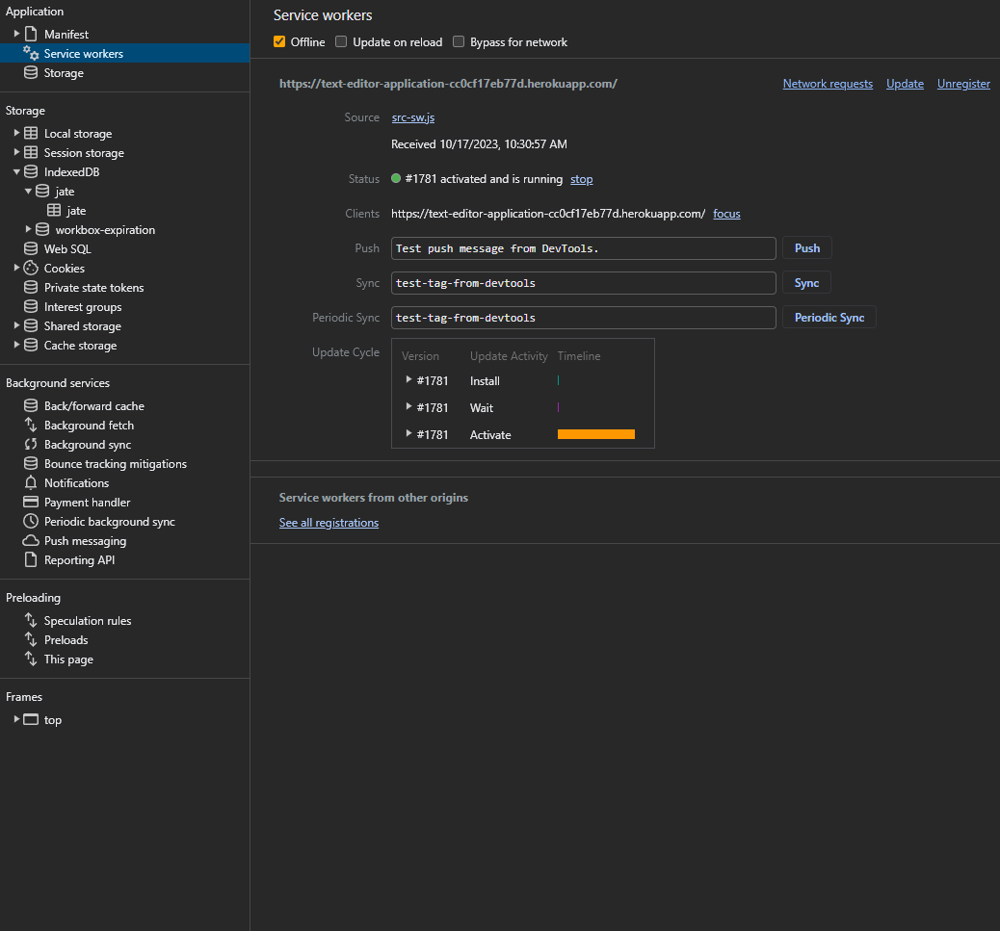
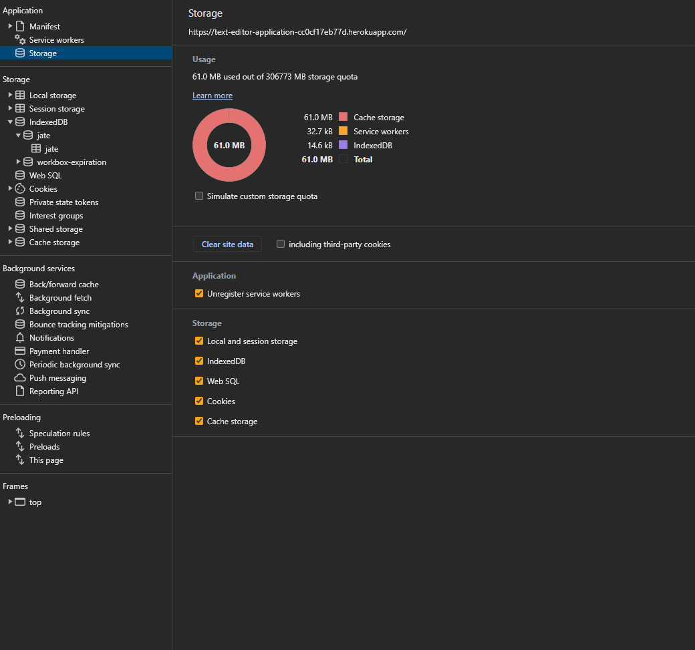

# text-editor-application

## Description

In this text editor app you're able to use this application locally on your machine just by installing the app. It has many different features like being able to use the text editor offline, and uses IndexedDB database to store the data.

## Table of Contents

* [Description](#description)
* [Installation](#installation)
* [Usage](#usage)

## Installation

Clone repo and run the following command to install all of the packages needed
```
npm i
```

Then run npm run build to build your dist folder which will bundle all of your files together
```
npm run build
```

Last run this command to start the application
```
npm start
```

## Usage

Visit the application deployed to [heroku](https://text-editor-application-cc0cf17eb77d.herokuapp.com/)







